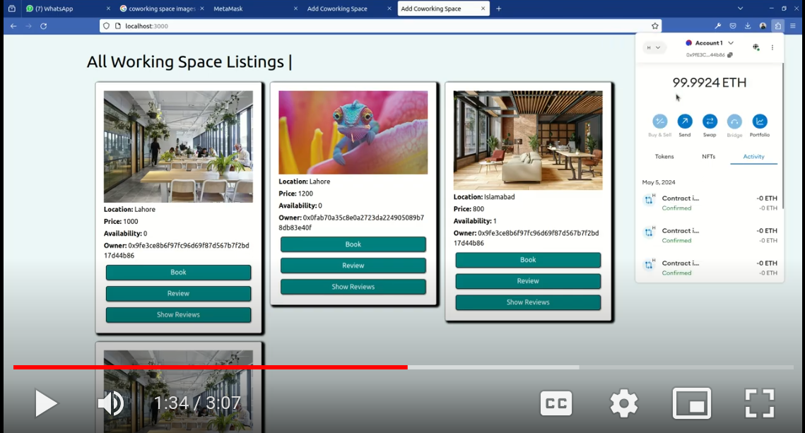

<!DOCTYPE html>
<html lang="en">

    
<head>
    <meta charset="UTF-8">
    <meta name="viewport" content="width=device-width, initial-scale=1.0">
</head>
<body>

<h1 align="center">CoWorkingSpace D-app 🏢💻🌐</h1>

    So this is my coworking space D-app which is basically a decentralized application. The software involved are MetaMask and Ganache, and the smart contracts are written in Solidity.

<h2>Project Overview 📜✨</h2>

    The project is a website designed for workspace listings, where users can upload listings for available workspaces. These workspaces could be offices, co-working spaces, or any other type of workspace that users might want to rent or share.

<h3>Features 🚀🔧</h3>

<h4>Upload Listing 📤🏢</h4>
<ul>
    <li>Users can create and upload listings for their workspaces.</li>
    <li>This feature involves creating a form where users can input details about their workspace, such as location, image, and pricing.</li>
    <li>Once submitted, this information is stored on the blockchain, ensuring transparency and immutability.</li>
</ul>

<h4>View All Listings 👀📋</h4>
<ul>
    <li>Users can view all available workspace listings.</li>
    <li>This feature provides a user-friendly interface where users can browse through all the listed workspaces.</li>
    <li>Each listing is displayed with key details, such as location and pricing.</li>
</ul>

<h4>Search Listing 🔍📍</h4>
<ul>
    <li>Users can search for specific types of workspaces based on their preferences.</li>
    <li>This feature involves implementing a search functionality where users can filter listings based on criteria like location.</li>
    <li>Users can quickly find relevant listings that match their requirements.</li>
</ul>

<h4>Upload Review 📝⭐</h4>
<ul>
    <li>Users can upload reviews for workspaces they have used.</li>
    <li>This feature allows users to provide feedback on their experiences with specific workspaces.</li>
    <li>Reviews are also stored on the blockchain to ensure transparency and trustworthiness.</li>
</ul>

<h4>Show Reviews 📢📝</h4>
<ul>
    <li>Listings provide an option to display reviews provided by users.</li>
    <li>This feature helps potential renters or buyers to make informed decisions by reading reviews from others who have used the workspace.</li>
    <li>Reviews can influence users' choices and provide valuable insights into the quality of each workspace.</li>
</ul>

<h3>Technology Stack 🛠️💻</h3>

Your project involves using various technologies:

<ul>
    <li><strong>HTML, CSS, and JavaScript</strong>: Used for building the frontend of the website, including the user interface and interactions.</li>
    <li><strong>Solidity</strong>: Used for writing smart contracts that handle the logic of storing and retrieving workspace listings and reviews on the blockchain.</li>
    <li><strong>Ganache</strong>: Used as a local blockchain for development and testing purposes.</li>
    <li><strong>MetaMask</strong>: Used as wallet manager.</li>
</ul>

<h3>How it Works ⚙️🔗</h3>

<h4>User Interaction 🖱️💬</h4>
<ul>
    <li>Users interact with the website's frontend to perform actions like uploading listings, searching for workspaces, and leaving reviews.</li>
</ul>

<h4>Backend and Blockchain 💾⛓️</h4>
<ul>
    <li>When a user uploads a listing or review, the data is sent to the backend, where it's processed and stored on the blockchain using Solidity smart contracts.</li>
    <li>Listings and reviews are stored on the blockchain in a decentralized manner, ensuring security and transparency.</li>
</ul>

<h4>Frontend Updates 🔄🖥️</h4>
<ul>
    <li>The frontend periodically fetches data from the blockchain and updates the UI to reflect the latest listings and reviews.</li>
</ul>
<h3>Video Demo 📹🎥</h3>

  
 Click on the pic to watch the video!

<h3>How to Run 🏃‍♂️💻</h3>

First of all, download the code <strong>co-working-space</strong>.

<ol>
    <li>Install the node modules:
        <pre>npm install</pre>
    </li>
    <li>Install and set up Ganache:
        <ol>
            <li>First, download Ganache.</li>
            <li>Navigate to the Downloads directory:
                <pre>cd ~/Downloads</pre>
            </li>
            <li>Make the Ganache AppImage executable:
                <pre>chmod +x Ganache-&lt;version&gt;-linux-x86_64.AppImage</pre>
            </li>
            <li>Update the system:
                <pre>sudo apt update</pre>
            </li>
            <li>Install Node.js and npm:
                <pre>sudo apt install nodejs npm</pre>
            </li>
            <li>Install Ganache globally:
                <pre>npm install -g ganache</pre>
            </li>
            <li>Run Ganache:
                <pre>ganache</pre>
            </li>
        </ol>
    </li>
    <li>Deploy smart contracts:
        <pre>truffle migrate</pre>
    </li>
    <li>Set up MetaMask:
        <ol>
            <li>Install MetaMask and import the wallet using the seed phrase provided by Ganache.</li>
        </ol>
    </li>
    <li>Connect MetaMask to your local blockchain:
        <ol>
            <li>Add a new network manually in MetaMask with the details of your local blockchain.</li>
        </ol>
    </li>
    <li>Run the frontend:
        <pre>npm run dev</pre>
    </li>
</ol>
